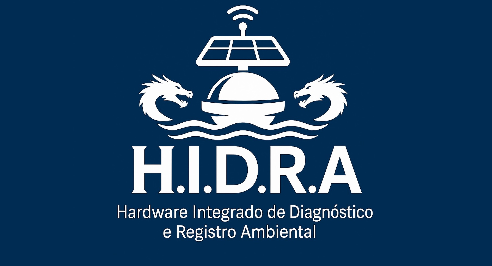

# 🌊 HIDRA
### Hardware Integrado de Diagnóstico e Registro Ambiental

  
  
  
  
  
  

---

## 🎯 **Sobre o Projeto**

O **HIDRA** é uma solução inovadora de monitoramento ambiental desenvolvida na **Universidade Federal Rural de Pernambuco** com financiamento da **FACEPE** através do programa **COMPET**. Nossa missão é revolucionar o monitoramento da qualidade das águas em canais urbanos através de tecnologia de ponta e inteligência artificial.

---

## 🚨 **Motivação**

A qualidade da água em canais a céu aberto é um indicador ambiental crítico. Atualmente, a obtenção dessas informações depende de análises laboratoriais que podem levar semanas ou até meses para gerar resultados. Isso limita a capacidade de resposta das instituições frente a eventos de contaminação, que muitas vezes ocorrem de forma rápida e silenciosa, prejudicando a fauna, flora e as comunidades ao redor.

> Em Pernambuco, essas análises são tradicionalmente conduzidas pela APAC (Agência Pernambucana de Águas e Clima). Porém, há uma necessidade urgente de modernizar esse processo.

### Desafios Atuais:
- ⏰ **Tempo de resposta crítico**: Análises laboratoriais tradicionais podem levar meses
- 🦠 **Contaminação rápida**: Poluentes podem afetar fauna e flora em horas ou dias  
- 🏛️ **Resposta institucional limitada**: APAC e outras instituições dependem de métodos manuais
- 📈 **Crescimento urbano**: Região Metropolitana do Recife enfrenta pressão crescente sobre recursos hídricos

---

## 🎯 **Nossa Solução**

### O HIDRA oferece:

#### 🔬 **Monitoramento Automatizado**
#### 🤖 **Inteligência Artificial Avançada**
#### ⚡ **Resposta Rápida**

---

## 🏙️ **Área de Atuação**

  
### Região Metropolitana do Recife
*Monitoramento inteligente de canais urbanos a céu aberto*

🏞️ **Canais a céu aberto** | 🏘️ **Áreas residenciais**

---

## 🛠️ **Tecnologias Utilizadas**

| Categoria | Tecnologias |
|-----------|-------------|
| 🔧 **Hardware** | ESP32, LoRa e sensores ambientais (pH, turbidez, OD, temperatura, etc.)|
| </> **Desenvolvimento** | Python, Django e REST API |
| 🤖 **IA/ML** | Análise preditiva, Random Forest |
| ☁️ **Cloud** | Armazenamento em nuvem, PostgreSQL |
| 📱 **Interface** | Dashboard web e mobile |

---

## 📈 **Impacto Esperado**

### 🌟 **Benefícios para a Sociedade**

| 🎯 **Objetivo** | 💪 **Resultado** |
|----------------|------------------|
| ⏱️ **Tempo de resposta** | De meses para **minutos** |
| 🛡️ **Prevenção** | **Detecção precoce** de contaminações |
| 💰 **Economia** | **Redução de custos** com análises laboratoriais |
| 🌍 **Sustentabilidade** | **Proteção ambiental** proativa |

## 🤝 **Parcerias e Apoio**

| Instituição | Papel |
|-------------|-------|
| 🎓 **UFRPE** | Desenvolvimento e pesquisa |
| 💼 **FACEPE** | Financiamento (Programa COMPET) |
| 🏛️ **APAC** | Parceiro institucional |

---

## 🎓 **Equipe de Desenvolvimento**
 **Universidade Federal Rural de Pernambuco**

#### **Equipe 1**

| Discente       | Curso                |
|----------------|----------------------|
| **Davi Melo**       | Engenharia Eletrônica |
| **Eric Lucas** | Engenharia Elétrica   |
| **Joyce Virginia**       | Engenharia Eletrônica |
| **Otávio Cavalcanti** | Engenharia Elétrica   |
| **Suyane Florencio**       | Engenharia Eletrônica |

#### **Equipe 2**

| Discente       | Curso                |
|----------------|----------------------|
| **Adriana Reis**   | Engenharia Elet### |
| **Alcidio Tenani** | Engenharia Elétrica   |
| **Gabriel Vitor**  | Engenharia Elet### |
| **Josuel Luna**    | Engenharia Elet### |
| **Thiago Santos**  | Engenharia Elet### |

## 📞 **Contato**

📧 Email: [hidrateams@gmail.com]  
🌐 Website: [www.hidra-eco.com.br]  
📍 Recife, Pernambuco, Brasil

---

### 🌊 *"Protegendo nossos recursos hídricos através da tecnologia"*

**HIDRA** - Hardware Integrado de Diagnóstico e Registro Ambiental

---

