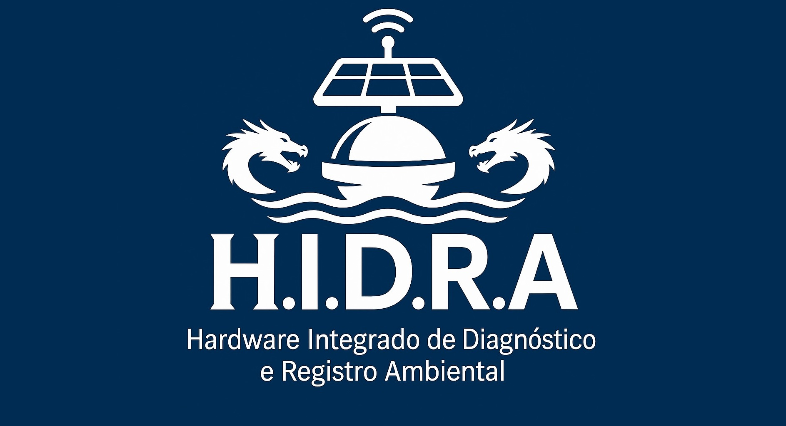

# HIDRA
O HIDRA(Hardware Integrado de Diagnostico e Registro Ambiental) é um projeto desenvolvido na Universidade Federal Rural de Pernambuco e financidado pela FACEPE no programa COMPET.

  

# MOTIVAÇÃO
A qualidade das águas em canais a céu aberto é uma informação valiosa que geralmente leva meses para ser extraída através de análises em laboratório. Uma contaminação poder afetar a fauna e flora desses canais em um intervalo curto de tempo, o que extingue a possibilidade de resposta das instituições responsáveis com os métodos tradicionais. Atualmente, em Pernambuco, essas análises são executadas pela APAC(Agência Pernambucana de Àguas e Clima). Dado a problematica citada, é preciso buscar meios de automatizar análises e previnir eventos de agressão aos rios e riachos.

# OBJETIVO
O HIDRA busca analisar canais a céu aberto na região metropolitana do recife de forma automatizada com o uso de AI para predizer contaminações, anormalidades e até enchentes.
